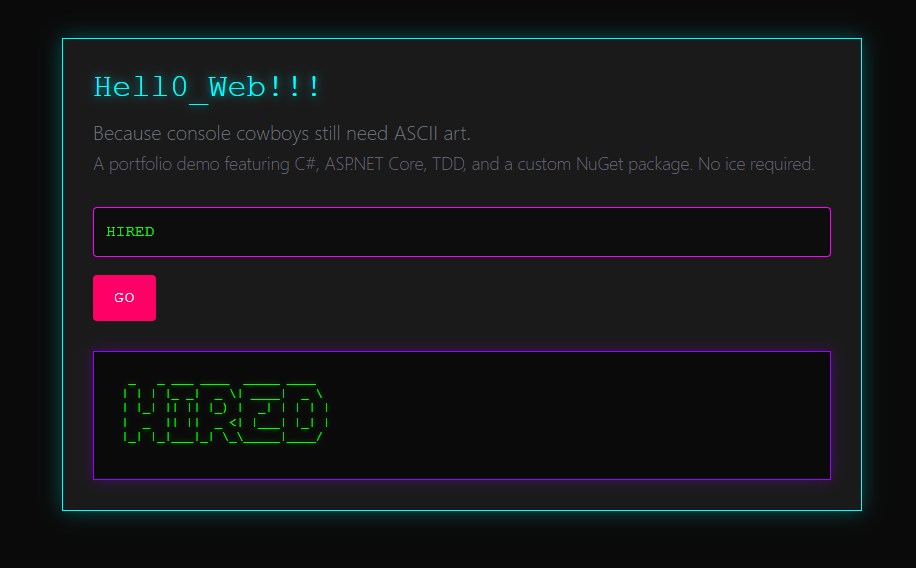

# Hell0_Web - ASCII Art Generator

**Live Demo:** [hell0-web-nicole-rowsey.azurewebsites.net](https://hell0-web-nicole-rowsey-hngadebad5dyhfcj.canadacentral-01.azurewebsites.net/)  
*(Free tier hosting - first load takes ~15 seconds to wake up)*

A full-stack C# web application that converts user input into ASCII art using a custom NuGet package. Built with ASP.NET Core MVC, test-driven development, and deployed to Azure.



---

## 🎯 What This Demonstrates

**Full-Stack Web Development:**
- ASP.NET Core 8.0 MVC architecture with Razor views
- RESTful routing and controller design
- Model validation and error handling
- Responsive UI with custom CSS (cyberpunk aesthetic inspired by Neuromancer)

**Test-Driven Development:**
- xUnit test suite with 90%+ code coverage
- Unit tests for controllers and models
- Red-Green-Refactor workflow visible in Git history

**Package Management & Distribution:**
- Created and published custom NuGet package ([Hell0_TDD.Core](https://www.nuget.org/packages/Hell0_TDD.Core/))
- Integrated third-party dependencies (Figgle ASCII rendering library)

**Cloud Deployment:**
- Azure App Service hosting
- Production environment configuration
- Scalable architecture ready for CI/CD integration

**Professional Development Practices:**
- Clean Git history with conventional commit messages
- Separation of concerns (MVC pattern)
- Comprehensive documentation

---

## 🚀 Quick Start

### Try it live:
1. Visit [the live demo](https://hell0-web-nicole-rowsey-hngadebad5dyhfcj.canadacentral-01.azurewebsites.net/)
2. Enter text (max 200 characters)
3. Click **Go** to see ASCII art rendered below

### Run locally:
```bash
git clone https://github.com/sooperD00/Hell0_Web.git
cd Hell0_Web/Hell0_Web
dotnet restore
dotnet run
# Navigate to https://localhost:7102
```

### Run tests:
```bash
cd Hell0_Web.Tests
dotnet test
```

---

## 🛠️ Tech Stack

| Layer | Technology |
|-------|-----------|
| **Backend** | ASP.NET Core 8.0 (MVC) |
| **Frontend** | Razor Views, HTML5, CSS3 |
| **Testing** | xUnit, Test-Driven Development |
| **ASCII Rendering** | Custom NuGet package (Hell0_TDD.Core) wrapping Figgle |
| **Deployment** | Azure App Service (Free F1 tier) |
| **Version Control** | Git with conventional commits |

---

## 📁 Project Structure
```
Hell0_Web/
├── Hell0_Web/                  # Main web application
│   ├── Controllers/
│   │   └── AsciiController.cs  # Handles form submission & rendering
│   ├── Models/
│   │   ├── AsciiInputModel.cs  # Input validation model
│   │   └── MaxLengthAttribute.cs # Custom validation attribute
│   ├── Views/
│   │   └── Ascii/Input.cshtml  # UI with form and output display
│   └── wwwroot/css/
│       └── site.css             # Neuromancer-inspired styling
│
├── Hell0_Web.Tests/            # Unit test suite
│   ├── AsciiControllerTests.cs
│   └── AsciiInputModelTests.cs
│
└── Hell0_Web.sln
```

---

## 🧪 Test-Driven Development Approach

This project follows strict TDD principles:
1. **RED:** Write failing test first
2. **GREEN:** Write minimal code to pass
3. **REFACTOR:** Clean up while keeping tests green

Example test coverage:
- ✅ Controller GET/POST actions
- ✅ Model validation (required fields, max length)
- ✅ ASCII rendering integration
- ✅ Error handling for invalid input

View commit history to see TDD workflow in action (tests committed before implementation).

---

## 🎨 Design Notes

**Cyberpunk Aesthetic:**  
Inspired by William Gibson's *Neuromancer*, the UI features:
- "Dead channel gray" backgrounds
- Electric cyan/purple neon accents with glow effects
- Monospace fonts (console cowboy vibes)
- "No ICE required" tagline 😎

---

## 🔮 Future Enhancements

- [ ] Font selection dropdown (integrate multiple Figgle fonts)
- [ ] AJAX rendering (update output without page reload)
- [ ] GitHub Actions CI/CD pipeline
- [ ] Integration tests for full request/response cycle
- [ ] Export ASCII art as image file

---

## 📄 License

MIT License - See [LICENSE](LICENSE) for details.

---

## 👤 About

Built by **Nicole Rowsey** as a portfolio demonstration project.  
*Part of a series showcasing C# development skills - see also: [Hell0_TDD.Core NuGet package](https://github.com/sooperD00/Hell0_TDD)*

**Connect:** [GitHub](https://github.com/sooperD00) | [LinkedIn](https://www.linkedin.com/in/nicole-rowsey)

---

*"Because console cowboys still need ASCII art." - Built with ☕ and test-driven discipline.*